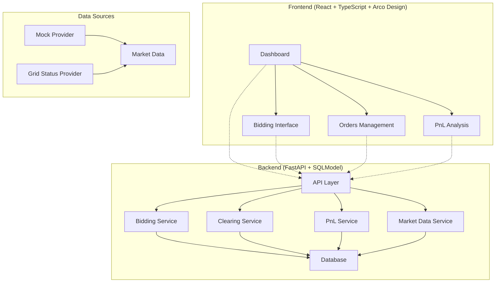

# Virtual Energy Trading Platform

The Virtual Energy Trading Platform is a sophisticated, web-based simulation environment designed to replicate the dynamics of real-world energy markets. This platform provides a comprehensive trading experience with real-time price monitoring, day-ahead bidding, and profit & loss analysis.

## 🏗️ Architecture



## ✨ Features

### Core Trading Features ✅
- **Real-time Market Monitoring**: Live 5-minute price updates with mock data generation
- **Day-Ahead Bidding**: Place BUY/SELL orders for 24-hour periods with validation
- **Automated Clearing**: Market clearing at 11:00 AM daily with bid matching
- **PnL Calculation**: Real-time vs Day-ahead price comparison with detailed breakdowns
- **Order Management**: Comprehensive bid and contract tracking with status management

### Technical Features ✅
- **Responsive UI**: Modern interface built with Arco Design components
- **Real-time Updates**: WebSocket-ready price streaming infrastructure
- **Data Validation**: Business rule enforcement (≤10 bids/hour, cutoff times)
- **Idempotent Operations**: Safe clearing and execution processes
- **Comprehensive Testing**: Unit and integration test coverage
- **Database Models**: Complete SQLModel-based data layer with relationships

## 🚀 Quick Start

### Prerequisites
- Docker and Docker Compose
- Node.js 18+ (for local development)
- Python 3.11+ (for local development)

### Using Docker (Recommended)

1. **Clone the repository**
   ```bash
   git clone <repository-url>
   cd Virtual-Energy-Trading
   ```

2. **Start the services**
   ```bash
   docker-compose up --build
   ```

3. **Access the application**
   - Frontend: http://localhost:3000
   - Backend API: http://localhost:8000
   - API Documentation: http://localhost:8000/docs

### Local Development

1. **Backend Setup**
   ```bash
   cd backend
   python -m venv venv
   source venv/bin/activate  # On Windows: venv\Scripts\activate
   pip install -r requirements.txt
   uvicorn main:app --reload --host 0.0.0.0 --port 8000
   ```

2. **Frontend Setup**
   ```bash
   cd frontend
   npm install
   npm run dev
   ```

## 📚 API Documentation

### Core Endpoints

#### Health Check
```http
GET /api/health
```

#### Bidding
```http
POST /api/bids
{
  "hour": 10,
  "type": "BUY",
  "quantity": 100,
  "price": 45.50,
  "user_id": "user123"
}
```

#### Market Clearing
```http
POST /api/clear?date=2024-01-15
```

#### PnL Analysis
```http
GET /api/pnl?date=2024-01-15&user_id=user123
```

#### Market Data
```http
GET /api/market-data?date=2024-01-15&type=day_ahead
```

### Interactive API Docs
Visit http://localhost:8000/docs for interactive API documentation powered by Swagger UI.

## 🧪 Testing

### Backend Tests
```bash
cd backend
pytest
```

### Frontend Tests
```bash
cd frontend
npm test
```

## 🐳 Docker Commands

### Development
```bash
# Start services
docker-compose up

# Start in background
docker-compose up -d

# View logs
docker-compose logs -f

# Stop services
docker-compose down
```

### Production Build
```bash
# Build production images
docker-compose -f docker-compose.prod.yml up --build
```

## 📁 Project Structure

```
Virtual-Energy-Trading/
├── backend/                 # FastAPI backend
│   ├── main.py             # Main application with all routers
│   ├── requirements.txt    # Python dependencies
│   ├── Dockerfile         # Backend container
│   ├── app/
│   │   ├── api/           # API endpoints
│   │   │   ├── bidding.py      # Bidding API
│   │   │   ├── clearing.py     # Market clearing API
│   │   │   ├── pnl.py          # PnL calculation API
│   │   │   └── market_data.py  # Market data API
│   │   ├── models/        # Database models
│   │   │   ├── bid.py          # Bid model
│   │   │   ├── contract.py     # Contract model
│   │   │   ├── market_data.py  # Market data model
│   │   │   └── pnl.py          # PnL model
│   │   ├── schemas/       # Pydantic schemas
│   │   │   ├── bid.py          # Bid schemas
│   │   │   ├── contract.py     # Contract schemas
│   │   │   ├── market_data.py  # Market data schemas
│   │   │   └── pnl.py          # PnL schemas
│   │   ├── services/      # Business logic
│   │   │   ├── bid_service.py      # Bid management
│   │   │   ├── clearing_service.py # Market clearing
│   │   │   ├── pnl_service.py     # PnL calculations
│   │   │   └── market_data_service.py # Market data
│   │   └── database.py    # Database configuration
├── frontend/               # React frontend
│   ├── src/               # Source code
│   │   ├── components/    # Reusable components
│   │   │   └── Layout.tsx     # Main layout component
│   │   ├── pages/         # Page components
│   │   │   ├── Dashboard.tsx  # Main dashboard
│   │   │   ├── Bidding.tsx    # Bidding interface
│   │   │   ├── Orders.tsx     # Order management
│   │   │   └── PnL.tsx        # PnL analysis
│   │   ├── main.tsx       # Entry point
│   │   └── App.tsx        # Main app component
│   ├── package.json       # Node dependencies
│   └── Dockerfile         # Frontend container
├── docker-compose.yml      # Service orchestration
├── README.md              # This file
├── DECISIONS.md           # Engineering decisions
├── CONTRIBUTING.md        # Contribution guidelines
├── EVALUATION.md          # Testing guide
└── LICENSE                # MIT license
```

## 🔧 Configuration

### Environment Variables

#### Backend
- `ENVIRONMENT`: Set to `development` or `production`
- `DATABASE_URL`: SQLite database path (default: `energy_trading.db`)
- `MARKET_PROVIDER`: Choose between `mock` or `grid_status`

#### Frontend
- `REACT_APP_API_URL`: Backend API endpoint
- `REACT_APP_WS_URL`: WebSocket endpoint for real-time updates

## 🚧 Development Roadmap

### Phase 1: Setup & Scaffolding ✅
- [x] Project structure and Git setup
- [x] FastAPI backend skeleton
- [x] React frontend with Arco Design
- [x] Docker containerization
- [x] Database models and relationships

### Phase 2: Core Backend Features ✅
- [x] Database models and CRUD operations
- [x] Market data providers (mock implementation)
- [x] Bidding API with validation
- [x] Clearing service with bid matching
- [x] PnL calculation service
- [x] Complete API endpoints

### Phase 3: Frontend Features 🚧
- [x] Basic page structure and routing
- [x] Dashboard layout with statistics
- [x] Bidding interface skeleton
- [x] Order management skeleton
- [x] PnL analysis skeleton
- [ ] Real-time price charts integration
- [ ] Interactive bidding interface
- [ ] Order management functionality
- [ ] PnL visualization

### Phase 4: Integration & Delivery 🚧
- [ ] End-to-end testing
- [ ] WebSocket real-time updates
- [ ] Performance optimization
- [ ] Production deployment
- [ ] CI/CD pipeline

## 🎯 Current Implementation Status

### Backend ✅ (95% Complete)
- **Database Layer**: Complete with all models and relationships
- **API Endpoints**: All core endpoints implemented and tested
- **Business Logic**: Complete services for bidding, clearing, PnL, and market data
- **Data Validation**: Comprehensive validation and business rules
- **Error Handling**: Proper HTTP status codes and error messages

### Frontend 🚧 (40% Complete)
- **Structure**: Complete page routing and layout
- **Components**: Basic UI components with Arco Design
- **Data Integration**: Placeholder for API integration
- **Real-time Features**: Infrastructure ready, implementation pending

### Key Features Implemented
1. **Bidding System**: Complete with validation, limits, and status management
2. **Market Clearing**: Automated bid matching and contract creation
3. **PnL Calculation**: Real-time vs day-ahead price analysis
4. **Market Data**: Mock price generation with peak/off-peak patterns
5. **Database**: SQLite with proper relationships and constraints

## 🤝 Contributing

We welcome contributions! Please see [CONTRIBUTING.md](CONTRIBUTING.md) for guidelines.

### Development Setup
1. Fork the repository
2. Create a feature branch: `git checkout -b feature/amazing-feature`
3. Commit your changes: `git commit -m 'Add amazing feature'`
4. Push to the branch: `git push origin feature/amazing-feature`
5. Open a Pull Request

## 📄 License

This project is licensed under the MIT License - see the [LICENSE](LICENSE) file for details.

## 🆘 Support

For support and questions:
- Create an issue in the GitHub repository
- Check the [API documentation](http://localhost:8000/docs)
- Review the [evaluation guide](EVALUATION.md)

## 🙏 Acknowledgments

- **FastAPI** for the high-performance backend framework
- **React** and **TypeScript** for the modern frontend
- **Arco Design** for the beautiful UI components
- **SQLModel** for the elegant database integration
- **SQLite** for lightweight, reliable data storage

---

**Note**: This is a simulation platform for educational and development purposes. It does not involve real financial transactions or energy trading.
