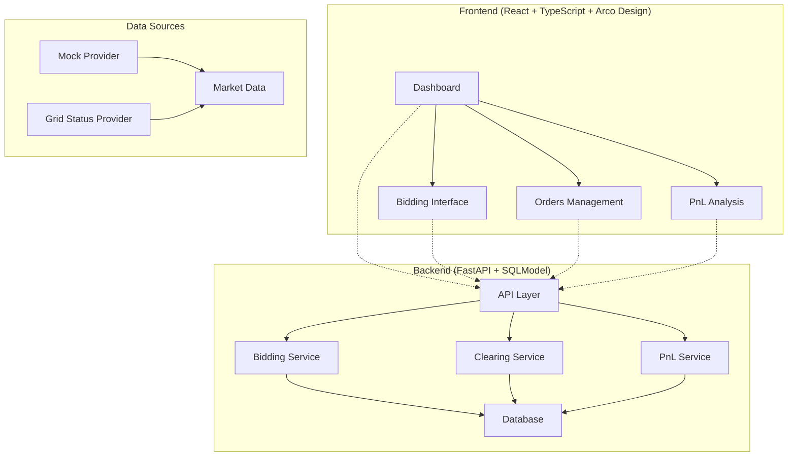

# Virtual Energy Trading Platform

The Virtual Energy Trading Platform is a sophisticated, web-based simulation environment designed to replicate the dynamics of real-world energy markets. This platform provides a comprehensive trading experience with real-time price monitoring, day-ahead bidding, and profit & loss analysis.

## 🏗️ Architecture



## ✨ Features

### Core Trading Features
- **Real-time Market Monitoring**: Live 5-minute price updates
- **Day-Ahead Bidding**: Place BUY/SELL orders for 24-hour periods
- **Automated Clearing**: Market clearing at 11:00 AM daily
- **PnL Calculation**: Real-time vs Day-ahead price comparison
- **Order Management**: Comprehensive bid and contract tracking

### Technical Features
- **Responsive UI**: Modern interface built with Arco Design
- **Real-time Updates**: WebSocket-based price streaming
- **Data Validation**: Business rule enforcement (≤10 bids/hour, cutoff times)
- **Idempotent Operations**: Safe clearing and execution processes
- **Comprehensive Testing**: Unit and integration test coverage

## 🚀 Quick Start

### Prerequisites
- Docker and Docker Compose
- Node.js 18+ (for local development)
- Python 3.11+ (for local development)

### Using Docker (Recommended)

1. **Clone the repository**
   ```bash
   git clone <repository-url>
   cd Virtual-Energy-Trading
   ```

2. **Start the services**
   ```bash
   docker-compose up --build
   ```

3. **Access the application**
   - Frontend: http://localhost:3000
   - Backend API: http://localhost:8000
   - API Documentation: http://localhost:8000/docs

### Local Development

1. **Backend Setup**
   ```bash
   cd backend
   python -m venv venv
   source venv/bin/activate  # On Windows: venv\Scripts\activate
   pip install -r requirements.txt
   uvicorn main:app --reload --host 0.0.0.0 --port 8000
   ```

2. **Frontend Setup**
   ```bash
   cd frontend
   npm install
   npm run dev
   ```

## 📚 API Documentation

### Core Endpoints

#### Health Check
```http
GET /api/health
```

#### Bidding
```http
POST /api/bids
{
  "hour": 10,
  "type": "BUY",
  "quantity": 100,
  "price": 45.50
}
```

#### Market Clearing
```http
POST /api/clear?date=2024-01-15
```

#### PnL Analysis
```http
GET /api/pnl?date=2024-01-15
```

### Interactive API Docs
Visit http://localhost:8000/docs for interactive API documentation powered by Swagger UI.

## 🧪 Testing

### Backend Tests
```bash
cd backend
pytest
```

### Frontend Tests
```bash
cd frontend
npm test
```

## 🐳 Docker Commands

### Development
```bash
# Start services
docker-compose up

# Start in background
docker-compose up -d

# View logs
docker-compose logs -f

# Stop services
docker-compose down
```

### Production Build
```bash
# Build production images
docker-compose -f docker-compose.prod.yml up --build
```

## 📁 Project Structure

```
Virtual-Energy-Trading/
├── backend/                 # FastAPI backend
│   ├── main.py             # Main application
│   ├── requirements.txt    # Python dependencies
│   └── Dockerfile         # Backend container
├── frontend/               # React frontend
│   ├── src/               # Source code
│   │   ├── components/    # Reusable components
│   │   ├── pages/         # Page components
│   │   └── main.tsx       # Entry point
│   ├── package.json       # Node dependencies
│   └── Dockerfile         # Frontend container
├── docker-compose.yml      # Service orchestration
├── README.md              # This file
├── DECISIONS.md           # Engineering decisions
├── API_DOCS.md            # Detailed API documentation
├── EVALUATION.md          # Testing guide
└── LICENSE                # MIT license
```

## 🔧 Configuration

### Environment Variables

#### Backend
- `ENVIRONMENT`: Set to `development` or `production`
- `DATABASE_URL`: SQLite database path
- `MARKET_PROVIDER`: Choose between `mock` or `grid_status`

#### Frontend
- `REACT_APP_API_URL`: Backend API endpoint
- `REACT_APP_WS_URL`: WebSocket endpoint for real-time updates

## 🚧 Development Roadmap

### Phase 1: Setup & Scaffolding ✅
- [x] Project structure and Git setup
- [x] FastAPI backend skeleton
- [x] React frontend with Arco Design
- [x] Docker containerization

### Phase 2: Core Backend Features 🚧
- [ ] Database models and CRUD operations
- [ ] Market data providers
- [ ] Bidding API with validation
- [ ] Clearing service
- [ ] PnL calculation service

### Phase 3: Frontend Features 🚧
- [ ] Real-time price charts
- [ ] Interactive bidding interface
- [ ] Order management
- [ ] PnL visualization

### Phase 4: Integration & Delivery 🚧
- [ ] End-to-end testing
- [ ] Performance optimization
- [ ] Production deployment
- [ ] CI/CD pipeline

## 🤝 Contributing

We welcome contributions! Please see [CONTRIBUTING.md](CONTRIBUTING.md) for guidelines.

### Development Setup
1. Fork the repository
2. Create a feature branch: `git checkout -b feature/amazing-feature`
3. Commit your changes: `git commit -m 'Add amazing feature'`
4. Push to the branch: `git push origin feature/amazing-feature`
5. Open a Pull Request

## 📄 License

This project is licensed under the MIT License - see the [LICENSE](LICENSE) file for details.

## 🆘 Support

For support and questions:
- Create an issue in the GitHub repository
- Check the [API documentation](API_DOCS.md)
- Review the [evaluation guide](EVALUATION.md)

## 🙏 Acknowledgments

- **FastAPI** for the high-performance backend framework
- **React** and **TypeScript** for the modern frontend
- **Arco Design** for the beautiful UI components
- **SQLModel** for the elegant database integration

---

**Note**: This is a simulation platform for educational and development purposes. It does not involve real financial transactions or energy trading.
